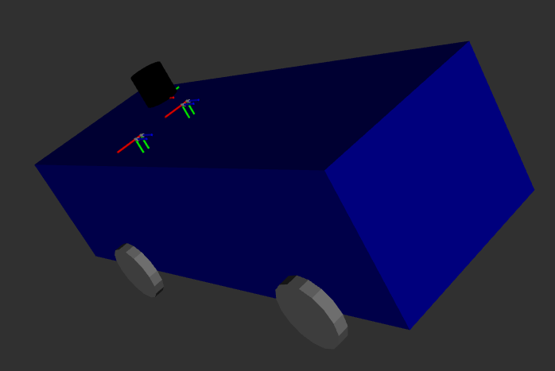

# ros2_kitti_description

***ros2_kitti_description*** is a package that generates vehicle URDFs for the [KITTI Vision Benchmark Odometry Dataset](https://www.cvlibs.net/datasets/kitti/eval_odometry.php).

Note that all URDFs for all sequences have been generated and can already be found in the `urdf` folder. Only run the instructions below if you want to regenerate the URDFs again.

## Instructions

1. Build this package, then `source ./install/setup.sh`
2. Download and unpack the calib files from [here](https://www.cvlibs.net/datasets/kitti/eval_odometry.php)
3. Generate the URDF for each sequence
   * `ros2 run ros2_kitti_description generate_urdfs -d [insert calib folder location here]/data_odometry_calib`
   * If package has been installed correctly, URDFs will be automatically saved to the shared directory of this installed package. Otherwise, they will be saved to the user's home directory
4. To visualize the generated URDFs, run
   * `ros2 launch ros2_kitti_description load_urdf.launch.py urdf_filename:=default.urdf.xml`
   * Replace `default.urdf.xml` with the desired file you want to view
   * URDFs must be located in the package's shared directory
